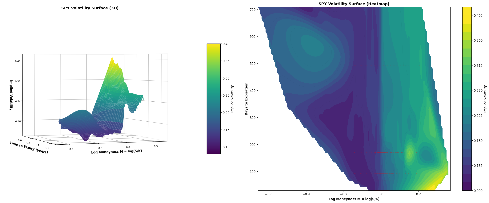

# Equity Derivatives: Pricing & Volatility Surface

Derivative pricing, Greeks, and implied vol surface calibration. Built with real option data.

## What's Here

- **Pricing models**: Black-Scholes, Monte Carlo, finite differences
- **Greeks**: Numerical and analytical computation
- **Volatility surface**: IV extraction, smile calibration, multi-expiry interpolation
- **Real data**: Cached option chains + live fetch from Yahoo Finance

## Volatility Surface



Example below uses SPY options, but the workflow supports any liquid US equity or index option chain.

SPY options show the expected patterns: smile effect (higher IV away from ATM), term structure (volatility rises from 1M to 24M), and decay in skew as expiration increases.

## Setup

```bash
python -m venv .venv
source .venv/bin/activate
pip install -r requirements.txt
```

## Run Demos

```bash
# Volatility surface construction from real data
jupyter notebook notebooks/demo_vol_surface.ipynb

# Pricing comparison
jupyter notebook notebooks/demo_pricing.ipynb
jupyter notebook notebooks/demo_bs_vs_mc.ipynb
```

## Test

```bash
pytest tests/ -v
```

21 tests covering IV calibration, smile extraction, surface building, and Greeks computation.

## Files

```
pricing/              - Black-Scholes, Monte Carlo, Greeks, IV calibration
vol_surface/          - IV extraction, smile fitting, surface interpolation
data/                 - Yahoo Finance fetching + cleaning
tests/                - 21 tests, all passing
notebooks/            - Interactive demos
```

## What Works

- Black-Scholes Greeks: <0.1% error vs numerical
- IV recovery: <0.01% error from BS prices
- Volatility surface: 575+ strikes, 8 expirations, cubic interpolation
- 21 tests passing in <1 second