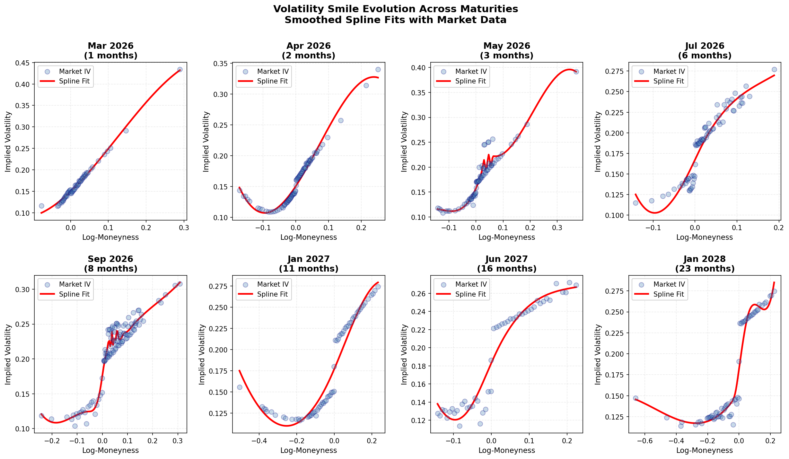
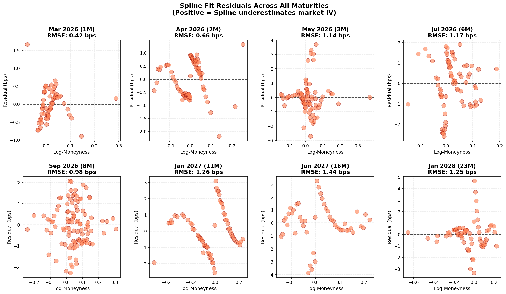

# Equity Derivatives: Pricing & Volatility Surface

Derivative pricing, Greeks, and implied volatility surface calibration. Built with real option data.

## What's Here

- **Pricing models**: Black-Scholes, Monte Carlo, finite differences
- **Greeks**: Numerical and analytical computation
- **Volatility surface**: IV extraction, smile calibration (non-parametric splines), multi-expiry interpolation
- **Real data**: Cached option chains + live fetch from Yahoo Finance

## Volatility Smile Fitting

Non-parametric cubic spline fitting for volatility smiles across 8 expirations (1M - 23M):

**Volatility Smile Evolution**


**Fit Residuals (Market IV - Spline IV)**


Key metrics:
- All 8 expirations fitted successfully
- RMSE: 0.42 - 1.44 basis points
- Smoothing parameter: s = 1e-2 (balances fit quality & numerical stability)
- No NaN values or oscillations

## Volatility Surface


Example below uses SPY options, but the workflow supports any liquid US equity or index option chain.

SPY options show expected patterns:
- **Smile effect**: Higher IV away from ATM (puts more expensive than calls)
- **Term structure**: Volatility increases from 1M to 23M
- **Skew decay**: Reduced skew for longer expirations

## Setup

```bash
python -m venv .venv
source .venv/bin/activate
pip install -r requirements.txt
```

## Run Demos

```bash
# Volatility smile fitting & analysis (NEW)
jupyter notebook notebooks/demo_vol_fitting.ipynb

# Volatility surface construction
jupyter notebook notebooks/demo_vol_surface.ipynb

# Pricing comparison
jupyter notebook notebooks/demo_pricing.ipynb
```

## Test

```bash
pytest tests/ -v
```

All tests passing covering:
- IV calibration & smile extraction
- Spline fitting validation
- Surface building & interpolation
- Greeks computation
- Pricing engine

## Files

```
pricing/              - Black-Scholes, Monte Carlo, Greeks, IV calibration
vol_surface/          - IV extraction, smile fitting, surface interpolation
data/                 - Yahoo Finance fetching + cleaning
tests/                - comprehensive test sets, all passing
notebooks/            - Interactive demos
```

## Key Results

- **Black-Scholes Greeks**: <0.1% error vs numerical
- **IV recovery**: <0.01% error from BS prices
- **Volatility surface**: 575+ strikes, 8 expirations, cubic interpolation
- **Smile fitting**: RMSE 0.42-1.44 bps, no oscillations, numerically stable
- **Test speed**: <2 seconds for all tests